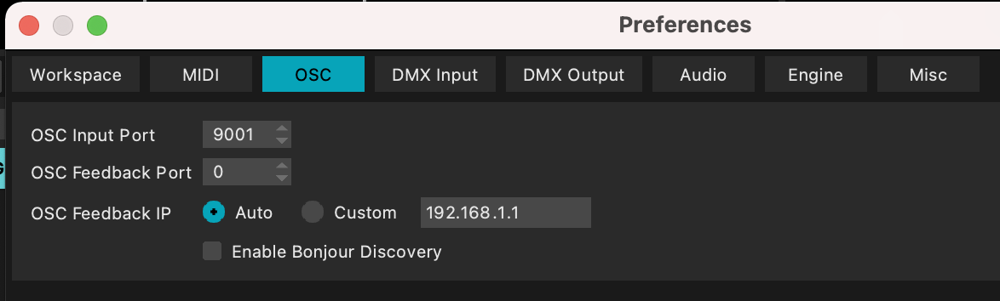

# Utiliser de l'OSC dans MadMapper

Préface : 
c'est mieux de maîtriser un peu MadMapper ou au moins d'avoir lu le tuto [MadMapper_2spi](https://github.com/LucieMrc/Madmapper_2spi).

Le but est de contrôler différents paramètres de MadMapper avec un téléphone communiquant en OSC, grâce l'application ZIG SIM.

Il faut donc au préalable installer ZIG SIM, et connecter le téléphone et l'ordinateur au même réseau wifi. 

Il est possible de récupérer directement les données depuis ZIG SIM, même si ce n'est pas idéal, ou de passer par Processing pour affiner le processus.

## Avec juste ZIG SIM

Dans le menu `Preferences` de MadMapper, ajuster le numéro de port pour être la même que celle sur ZIG SIM. 

Laisser l'OSC Feedback IP en Auto, et décocher le mode Enable Bonjour Discovery.

Dans ZIG SIM, le format de message doit donc être en OSC, et c'est mieux si le nom du téléphone (DEVICE UUID) est un truc simple en un seul mot.

L'adresse IP doit être la même que celle de l'ordinateur, qu'on peux récupérer dans les paramètres réseaux :

Ensuite, dans MadMapper, pour contrôler par exemple la valeur de la rotation de notre texture vidéo avec le téléphone, on clic-droit sur le slider rotation > `Add Control` > `OSC`.

On arrive ainsi dans la fenêtre `Control List`, dans l'onglet OSC, avec la liste de contrôle (qui ne contient ici que celui qu'on vient de créer).

Pour récupérer par exemple la première donnée, x, de l'accéléromètre du téléphone, on sélectionne "/lucie/accel/#1" (ici "lucie" le nom du téléphone).
En cliquant sur `Learn` en déplaçant le téléphone pour obtenir des valeurs, on obtient la plage de valeurs que cette donnée prend, qui est ensuite mise à l'échelle sur la plage de valeur de la rotation de la texture.

La Source range (= l'étendue de valeurs) par défaut est entre 0 et 1, alors que ZIG SIM envoit des valeurs sur des plages de données différentes.

La Target range est l'étendue de valeurs du paramètre controlé (ici entre 0 et 360° pour la rotation).

## En passant par Processing

Comme pour l'utilisation de ZIG SIM seul, il faut s'assurer que l'ordinateur et le téléphone sont sur le même réseau wifi et que l'adresse IP dans ZIG SIM est celle de l'ordinateur.

Dans le code d'exemple *osc2osc*, le port d'arrivée des messages doit être le même que celui précisé dans ZIG SIM (ici, toujours 9000) :

Une fois qu'on a assuré la liaison ZIG SIM-Processing, on peux choisir la valeur qu'on récupère, à la ligne 32 : */lucie/compass* où lucie est le nom du téléphone et compass le nom de la valeur dans ZIG SIM.

Si on reçoit ce message, on assigne sa valeur à la variable *cvalue*, puis on map cette valeur de manière qu'elle soit entre 0 et 1 pour correspondre à la Source range par défaut de MadMapper. 
La valeur mappée est assignée à la variable *send*, qui est envoyée à chaque fois qu'elle change (= que la valeur récupérée *send* est différente de la valeur précédente *psend*).

Grâce à la fonction *sendOSC()*, on envoit la valeur *send* qu'on nomme */compas*.
On peux envoyer autant de messages que l'on veux avec des valeurs différentes, en récupérant les autres données de ZIG SIM.

Dans le menu `Preferences` de MadMapper, il faut vérifier que l'OSC Input Port est bien le même que celui précisé dans le setup de Processing, ici 9001 :

Il faut laisser l'OSC Feedback IP en auto et ne pas autoriser Bonjour Discovery :

Ensuite, pour contrôler la valeur de la rotation de notre texture vidéo, on clic-droit sur le slider rotation > `Add Control` > `OSC`.

On arrive ainsi dans la fenêtre `Control List`, dans l'onglet OSC, avec la liste de contrôle (qui ne contient ici que celui qu'on vient de créer).

Pour récupérer notre message */compas* de Processing, on peux soit écrire directement le nom du message dans l'OSC address, soit cliquer sur `Learn` afin de détecter et lister les messages reçus sur le port 9001.

La Source range (= l'étendue de valeurs) par défaut est entre 0 et 1, comme notre valeur mappée dans Processing.

La Target range est l'étendue de valeurs du paramètre controlé (ici entre 0 et 360° pour la rotation).

## Pour aller + loin

Le tuto [utilisation du Spatial Scanner](https://github.com/LucieMrc/MadMapper-SpatialScanner-Tuto) pour scanner rapidement des scènes et en sortir une image correspondant à ce que "voit" le projecteur.